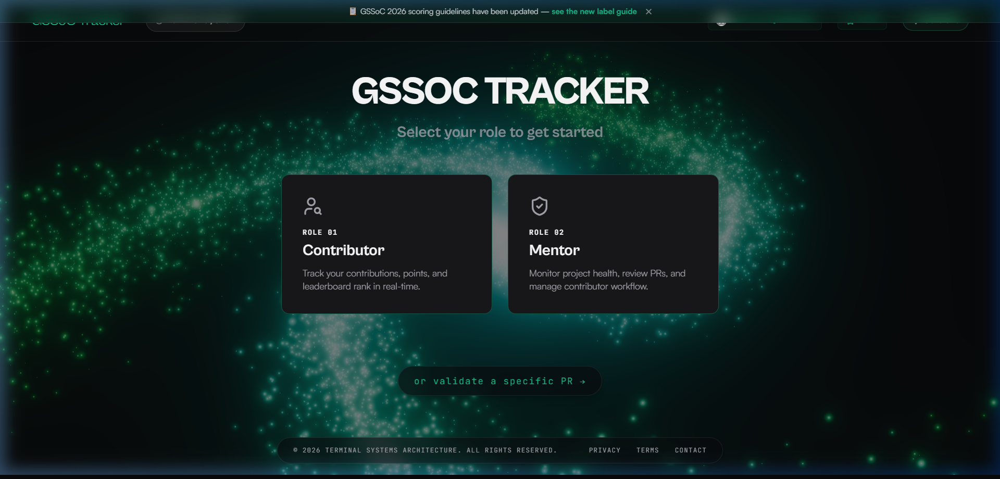
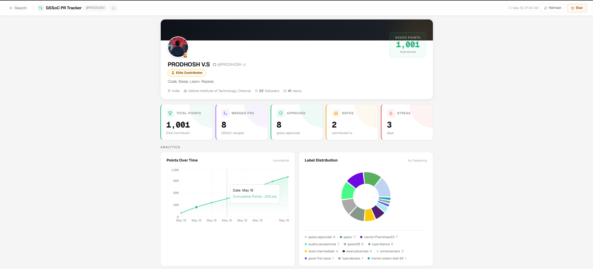
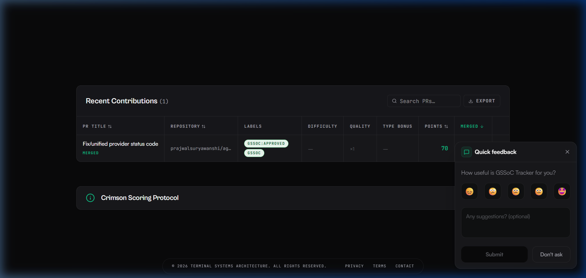
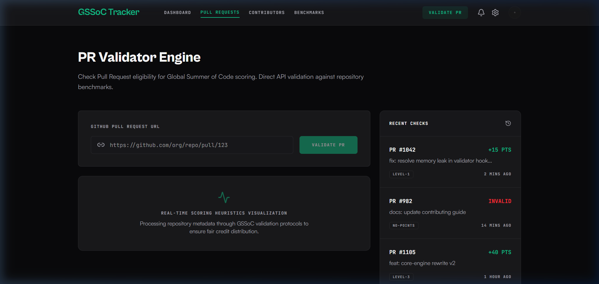
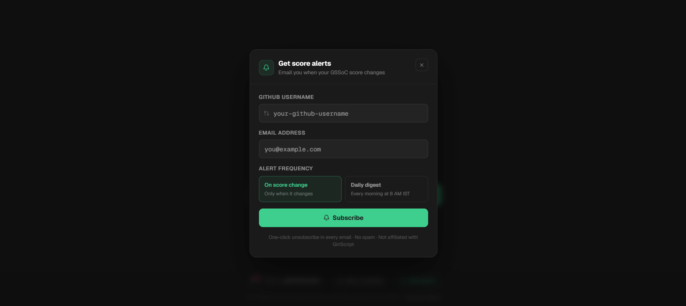
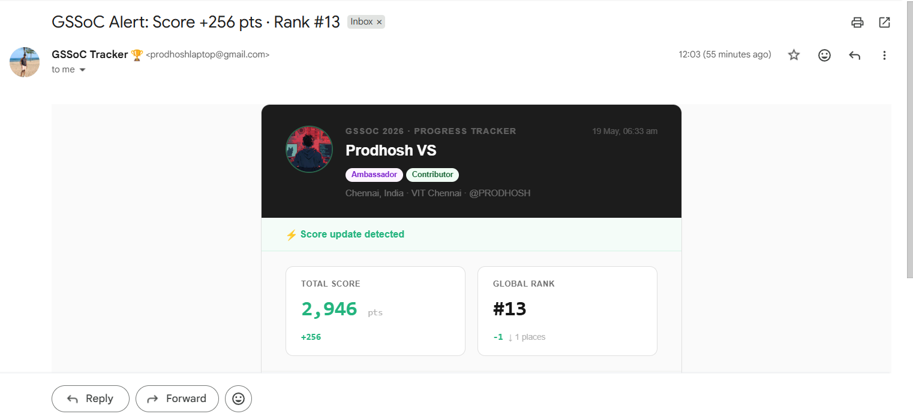

<h1 align="center">GSSoC Tracker</h1>

<p align="center">A fast, premium tracker for GSSoC 2026 contributors and mentors — with hardware-accelerated animations and real-time analytics.</p>

<p align="center">
  <a href="https://gssoc-tracker.vercel.app">gssoc-tracker.vercel.app</a> &nbsp;·&nbsp;
  <a href="https://github.com/pratyush06-aec/gssoc_pr_tracker/stargazers">
    
  </a>
</p>

> Not affiliated with GirlScript Summer of Code or GirlScript Foundation.



---

## Why this exists

The official GSSoC leaderboard takes time to load, and that makes sense. It is processing 45,000+ contributors filtered to specific registered project repos — that is a genuinely hard problem at scale.

But as a contributor, I just wanted a fast personal view of my own PRs, with labels, charts, and a score breakdown I could actually read. So I built it for myself.

When I shared it with a few people, one thing became obvious: a lot of contributors had no idea whether their PRs had actually been accepted. They could not tell if a label had been applied, if their score had changed, or why two similar PRs gave different points. This tool answers those questions directly.

That is why it is out for the community. It is not trying to replace the official tracker. It is just a faster, clearer way to understand your own contributions. Over 800 people use it now.

---

## What it does

You pick your role — contributor or mentor — enter your GitHub username, and the tracker pulls your relevant PRs and calculates your score. Everything is filtered to officially registered GSSoC 2026 projects, so the score you see here aligns with what the official leaderboard uses.

### Contributor tracker





Fetches all your public **merged** PRs that carry GSSoC labels and scores them using the official formula. Open or closed-without-merge PRs are shown for reference but do not count toward your total.

```
Score = 50 + (difficulty × quality multiplier) + type bonus
```

| Label | Points |
|---|---|
| `level:beginner` | 20 pts |
| `level:intermediate` | 35 pts |
| `level:advanced` | 55 pts |
| `level:critical` | 80 pts |
| `quality:clean` | ×1.2 multiplier |
| `quality:exceptional` | ×1.5 multiplier |
| `type:docs` | +5 pts |
| `type:bug` / `type:feature` / `type:testing` / `type:design` / `type:refactor` | +10 pts |
| `type:accessibility` / `type:performance` / `type:devops` | +15 pts |
| `type:security` | +20 pts |

PRs tagged `gssoc:invalid`, `gssoc:spam`, or `gssoc:ai-slop` score 0.

### Mentor tracker

If you are a GSSoC mentor, you can track the PRs you have reviewed. It searches for PRs labelled `mentor:yourusername` and `gssoc:approved` — filtered to official repos — and calculates your mentor score. Only **merged** PRs count toward your total.

```
Score = level base + quality bonus
```

| Label | Points |
|---|---|
| `level:beginner` | 10 pts |
| `level:intermediate` | 20 pts |
| `level:advanced` | 30 pts |
| `level:critical` | 50 pts |
| `quality:clean` | +5 pts |
| `quality:exceptional` | +10 pts |

### PR Validator



Ever submitted a PR and wondered — does this actually count? Go to [/pr-check](https://gssoc-tracker.vercel.app/pr-check), paste the GitHub PR link, and you get an instant answer.

It runs through every condition that matters:

- Is the `gssoc:approved` label on it?
- Has it been merged?
- Is the repo part of the officially registered GSSoC 2026 projects?
- Does it have any disqualifying flags like `gssoc:spam` or `gssoc:ai-slop`?

For each condition it tells you clearly what is passing, what is missing, and what you need to fix. If the PR does count, it shows the full points breakdown — base score, difficulty, quality multiplier, type bonuses — so you know exactly how many points it is worth.

No username needed. Just the PR link.

### Analytics

Both tracker pages include three interactive charts:

- **Level distribution** — breakdown of your PRs by difficulty level
- **Quality distribution** — how many PRs had a quality label vs none
- **Contribution growth** — a growth chart tracking PR merge velocity over time

All chart sections animate into view with a zig-zag scroll entrance as you navigate the dashboard.

---

## Visual experience

The tracker is designed to feel premium and interactive, not just functional. Here is what powers the visual layer:

### 🌌 WebGPU Galaxy Background
The landing page renders a `three.js` (WebGPU) interactive galaxy behind the UI. If the browser does not support WebGPU, it gracefully degrades without breaking the page. Type declarations for experimental Three.js modules live in `src/types/three.d.ts`.

### ✨ Click Explosions
Clicking anywhere on the screen spawns 20 neon-green snowflake icons at the cursor position using GSAP timelines (`src/components/animations/ClickExplosion.tsx`). DOM nodes are garbage-collected on animation completion to prevent memory leaks.

### 📦 3D Stacked Stats Grid
The stats grid (`src/components/pr-tracker/StatsGrid.tsx`) is a state-driven GSAP Client Component. Cards pile up in the center with 3D depth — staggered Y-offsets, horizontal fanning, descending scale, and alternating rotations — then fan out into their natural grid positions on hover or tap. An internal timer auto-collapses the stack after 7 seconds of inactivity.

### 🔀 Zig-Zag Scroll Animations
A reusable `ScrollSlideIn` wrapper component uses GSAP `ScrollTrigger` to slide sections in from alternating sides as the user scrolls, creating a deliberate left-right-left entrance sequence across the dashboard.

### 📊 Contribution Heatmap
A GitHub-style green activity grid (`ContributionHeatmap.tsx`) visualizes PR merge frequency over time, displayed alongside the analytics charts.

---

## Component architecture

The UI is broken into focused, semantic React components:

- **Landing page:** `LandingHero`, `LandingFeatures`, `LandingProtocol`, `LandingScoring`, `HomeNavbar`
- **PR Tracker:** `TrackerNavbar`, `GitHubProfileCard`, `StatsGrid`, `PRTable`, `ContributionHeatmap`, `AnalyticsCharts`, `ScoringGuide`
- **Mentor dashboard:** `MentorNavbar`, `MentorStats`, `MentorCharts`
- **PR Validator:** `ValidatorNavbar`, `ValidatorSpecs`, `ValidatorHistory`
- **Shared animations:** `ClickExplosion`, `ScrollSlideIn`
- **Shared utilities:** `LiveClock`, `QuickFeedbackPopup`, `HomeFooter`

---

## Email alerts



You can subscribe to get email alerts whenever your score or rank changes. Hit "Get alerts" on the home page, enter your GitHub username and email, and choose between instant notifications or a daily morning digest.



When your score changes, you get an email showing exactly what changed, which PRs contributed, and a one-click unsubscribe link.

---

## Running locally

```bash
git clone https://github.com/pratyush06-aec/gssoc_pr_tracker
cd gssoc_pr_tracker
npm install
```

Copy the example env file and fill in your values:

```bash
cp .env.local.example .env.local
```

The env vars you need:

| Variable | What it is |
|---|---|
| `GH_TOKEN` | GitHub personal access token (public_repo read only) — increases API rate limit from 60 to 5000 req/hr |
| `SMTP_USER` | Gmail address for sending alert emails |
| `SMTP_PASS` | Gmail app password (not your account password) |
| `NOTIFY_EMAIL` | Where feedback and admin emails are sent |
| `SYNC_SECRET` | Secret key for the score sync webhook |
| `APP_URL` | Your deployment URL |

Then start the dev server:

```bash
npm run dev
```

Open `http://localhost:3000` and you are good to go.

---

## Tech stack

- **Next.js 16** (App Router, server components, `unstable_cache` for GitHub API caching)
- **TypeScript**
- **Tailwind CSS** with a heavily customized theme (`canvas-night`, `primary-deep`, glassmorphism tokens)
- **GSAP** (`gsap`, `@gsap/react`, `ScrollTrigger`) for all DOM-level animations (3D stats grid, scroll entrances, click particles)
- **Three.js** (WebGPU renderer) for the landing page galaxy background
- **Recharts** for all data visualization charts
- **Nodemailer** for email alerts
- **Vercel** for hosting and edge caching

No database. No auth. No external services beyond GitHub API and Gmail.

---

## Developer guidelines

If you are contributing to or extending this project, keep the following in mind:

1. **GSAP is core.** GSAP is heavily integrated into the layout. If a component behaves strangely on mount, check for conflicting CSS transitions or GSAP `.set()` initializations. Always clean up GSAP timelines in your `useEffect` return function to prevent memory leaks.
2. **WebGPU nuances.** The Galaxy Background relies on experimental Three.js APIs. Keep `src/types/three.d.ts` updated if you import further experimental add-ons, or the Next.js production build will fail type-checking.
3. **Z-index management.** The `StatsGrid` dynamically alters `z-index` (from 50 down to 1) during its hover expansion. Ensure surrounding absolute elements (like the `ClickExplosion` wrapper at `z-index: 9999`) do not interfere with pointer events.
4. **Overflow discipline.** The `ScrollSlideIn` component offsets elements by `400px` off-screen before animating them in. Parent containers must enforce `overflow-x-hidden` to prevent horizontal scrollbar flashes.

---

## Important note

This is an independent community tool, not affiliated with GirlScript Summer of Code or GirlScript Foundation. Scores are filtered to officially registered GSSoC 2026 projects, so they align with the official leaderboard. For your exact official standing, always check the GSSoC leaderboard directly.

---

## Credits

**Originally created by [Prodhosh V.S](https://github.com/PRODHOSH)** — GSSoC 2026 Ambassador + Contributor, VIT Chennai. Built as a personal utility, kept because it turned out useful for over 800 people.

**Visual overhaul and animation layer by [Pratyush](https://github.com/pratyush06-aec)** — GSAP animations, Three.js WebGPU galaxy, 3D stacked stats grid, zig-zag scroll entrances, contribution heatmap, and modular component architecture.

[](https://github.com/pratyush06-aec/gssoc_pr_tracker)
